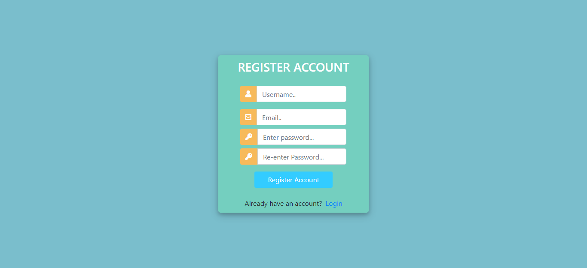
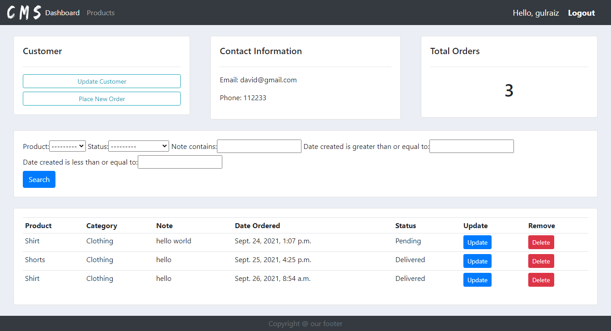

<div align="center">
<h1>Customer Management System</h1>



</div>

## Functionalities
- [x] User Authentication
- [x] User Authorization
- [x] Database CRUD Operations
- [x] User Profile Creation
- [x] Profile Image
- [x] Password Reset through Email
- [x] Dynamic Search Bar

## Installation steps

Clone the Repo and install the requirements

```
git clone https://github.com/gulraiznoorbari/Customer-Management-System-Django.git
cd Customer-Management-System-Django
pip install -r requirements.txt
python manage.py makemigrations
python manage.py migrate
python manage.py runserver
```


